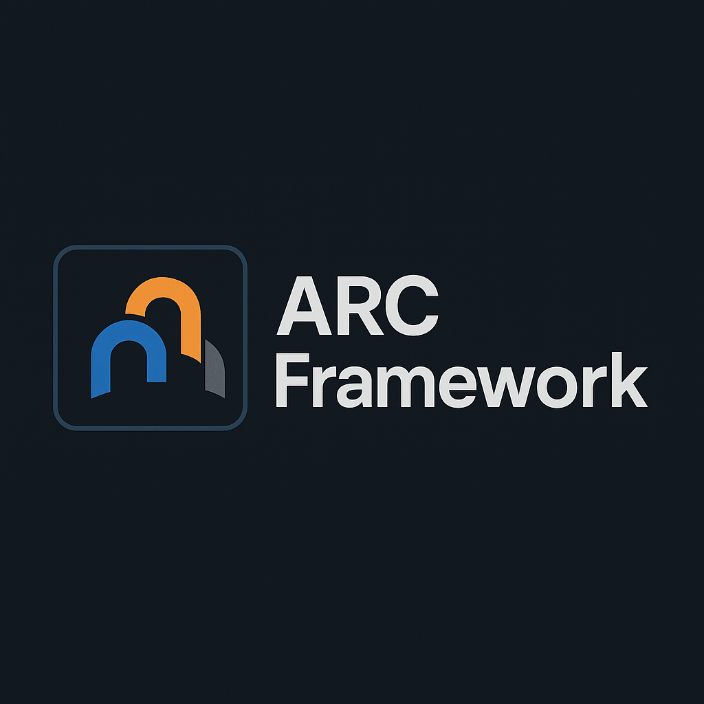

# ARCFramework

"ARC Framework (Action-Reaction-Control) is a modular and extensible system designed for Unreal Engine, providing a unified structure to manage character stats, actions, buffs, AI behavior, and game data — all built on a modular, dynamic foundation designed for deep gameplay control through the seamless integration of action execution, reactive systems, and control logic."
~~~~~~~~